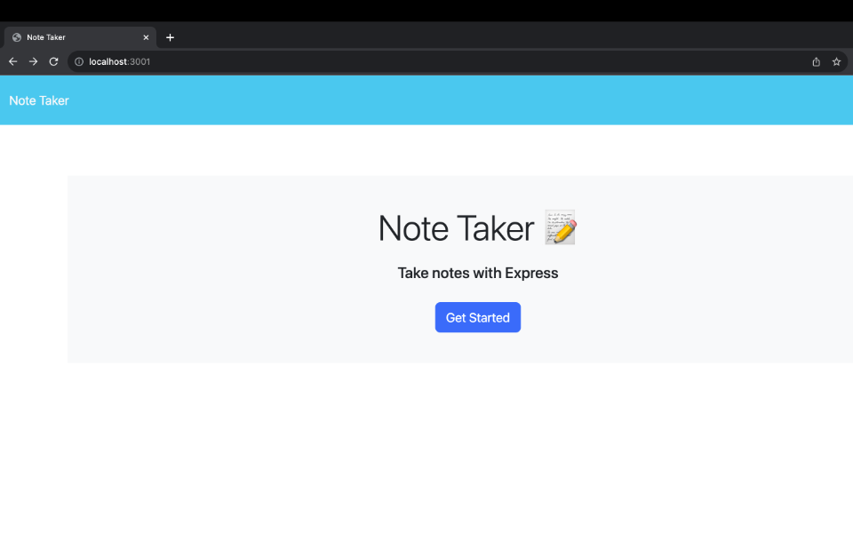
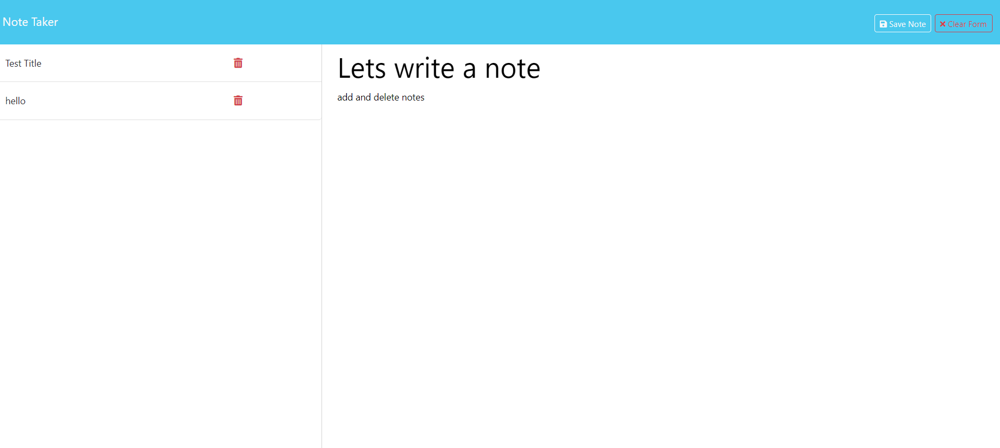

# Note-Taker

## Description
  An application called Note Taker that can be used to write and save notes. 
  * This application will use an Express.js back end and will save and retrieve note data from a JSON file.
  * A Node.js with Express application that allows a user to save and delete notes.

## Screenshot
  
  

## Installation
Clone the repository:

Install the dependencies: NPM install inside your terminal

Start the server: Node server.js

Open your browser and navigate to http://localhost:3001.

## Deployed Site
[Website](https://notetaker13-8e6ccb666c04.herokuapp.com/)